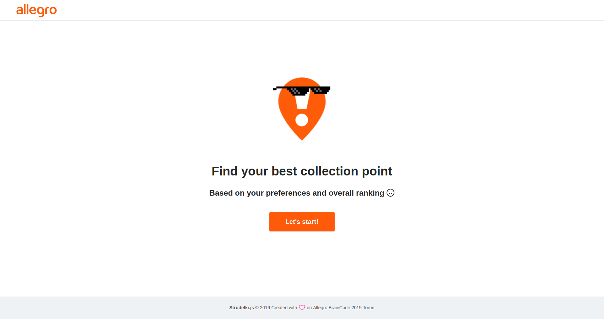
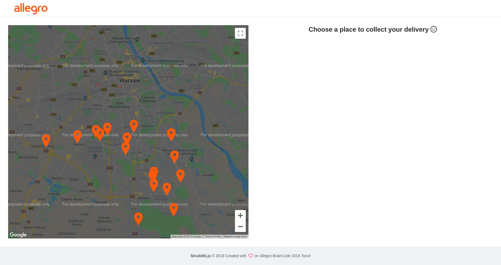
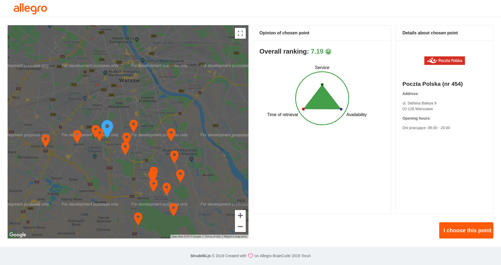
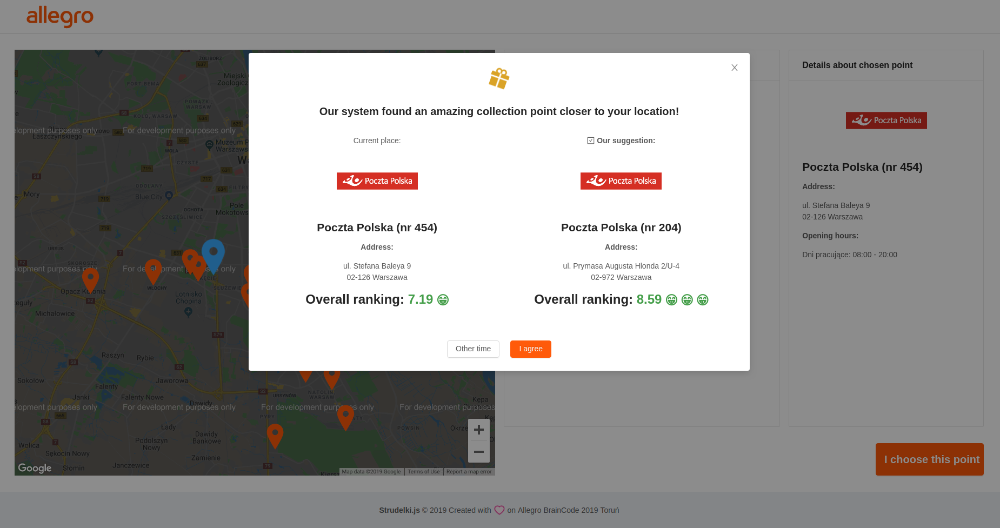
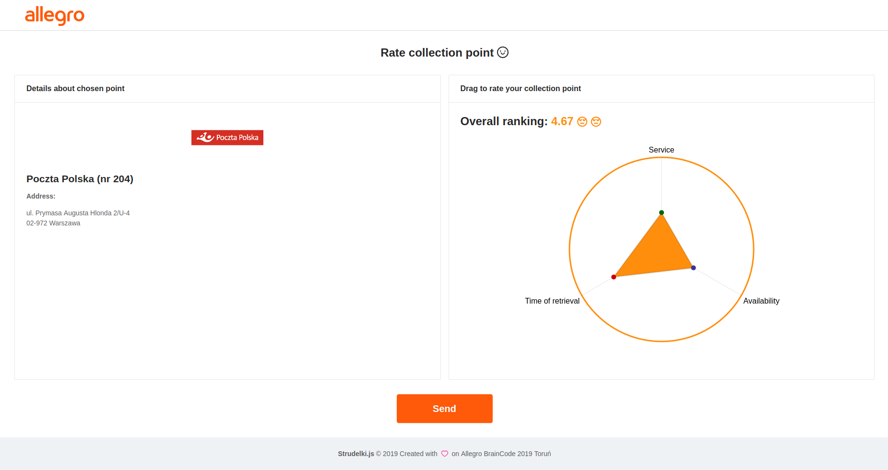

Web application, which allows users to rate collection point and find the best one(based on their preferences, location and other users ratings) using Google Maps API

In order to use Google Maps go to https://developers.google.com/maps/documentation/embed/get-api-key and get an **API key**. You can use version for developers without billing. 

Open **/frontend/.env** file and paste: REACT_APP_MAPS_API_KEY=yourApiKey putting there generated value.

`npm install`  Installs node_modules

`npm start`  Runs the app in the development mode. Open http://localhost:3000 to view it in the browser.

Run frontend and backend with npm or yarn. 

1) Welcome page, let's start finding best point for you!

2) There's plenty of collection point in Warsaw, choose which interests you.

3) On the right side, you can see overall ranking of this point as well as details of retrieval.

4) If there is more suitable point, we will tell you about it! We search for better location or opinion. You can accept it or stay with your first choice.

5) At the end we would like to share your experience with particular point by setting 3 factors on a triangle.

